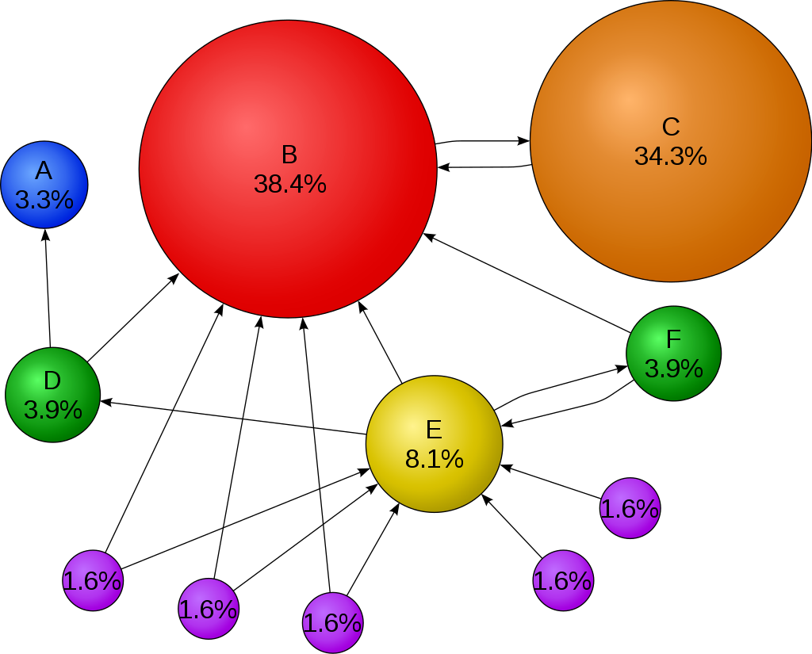
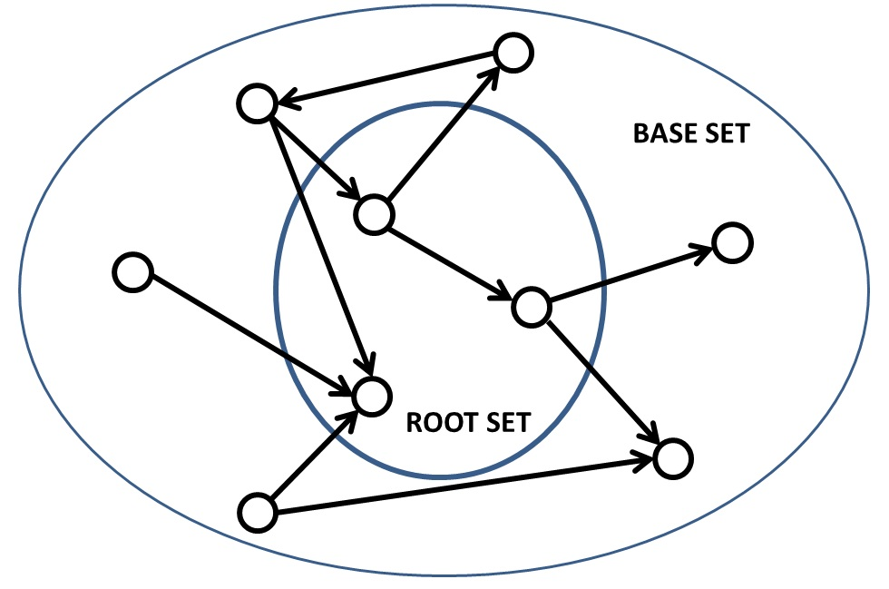

# 📃🔍 PageRank / HITS computation

<table><tr>
<td> 
  <p align="center" style="padding: 10px">
    
    <br>
    <em style="color: grey">PageRank (Google)</em>
  </p> 
</td>
<td> 
  <p align="center">
    
    <br>
    <em style="color: grey">HITS (Ask.com)</em>
  </p> 
</td>
</tr></table>


C++ implementation of the **PageRank** algorithm (Google) by Sergey Brin and Lawrence Page and the **HITS** algorithm (Ask.com) by Jon Kleinberg, that uses a **CSR** (Compressed Sparse Row) matrix and **mmap** to minimize memory usage.

This script computes the top-k nodes based on the rankings of the two algorithms, adds the in-degree of the node, and calculates the Jaccard coefficient between the results.

This project is the assignment for the course **Information Retreival and Web Search 2021/2022**.

See **[Assignment.pdf](Assignment.pdf)** for more details on the assignment.

See **[Report.pdf](report.pdf)** for more details on the implementation.

The assets are from the **SNAP Datasets** by Jure Leskovec and Andrej Krevl, available [here](http://snap.stanford.edu/data).

## 🔧 Building

```bash
mkdir build
cd build
cmake ..
make
```

## 🕹️ Usage

```
./pagerank-hits [filename] [topK] [dampingFactor]

Find top-K results of each algorithm in the graph and the Jaccard's coeffiecient between the algorithms.

OPTIONS:

    filename          The graph to process (default: assets/web-NotreDame.txt)
    topK              Set top-K number (default: 20)
    dampingFactor     Set PageRank's damping factor (default: 0.85)

```

If you run `./pagerank-hits` without arguments it will run with the default arguments, so it's the same as writing:

```
./pagerank-hits assets/web-NotreDame.txt 20 0.85
```
